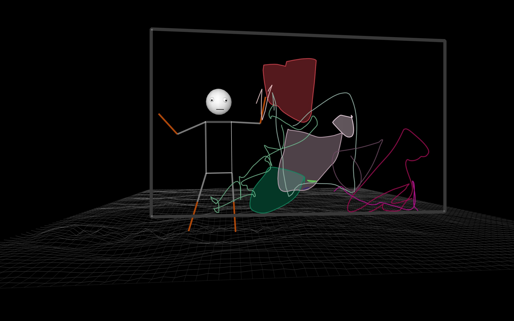

## Marionet ##
#### Description ####
This project uses p5.js to create an interactive experience that combines a moving puppet with the creation of an abstract canvas of color areas. The puppet is controlled by mouse actions, and as you move across the screen, the puppet and the color areas dynamically respond.
### Features ###
+ **Interactive Puppets:** *Control the puppet's movement using the mouse. The puppet responds to the real-time position of the cursor.*
+ **Abstract Canvas:** *The canvas gradually fills with moving and shape-shifting color areas. Each interaction with the puppet can influence the ever-evolving visual composition.*
* **Dynamic Interaction:** *Observe how the color areas interact with each other and with the puppet as you move within the frame. Each movement creates a unique visual experience.*
### Installation ###
1. Clone the repository to your local machine using 'git clone https://github.com/Marcomano28/Marcomano28.git'.
2. Open the project folder in your preferred code editor.

### Usage ###
1. Open the index.html file in your web browser to start the application.
2. Use the left mouse key to start drawing and the space key on the keyboard to stop and cut the line. 

3. Move the mouse cursor within the frame to control the puppet and observe how it affects the visual composition.

### Contributing ###
If you would like to contribute to this project, please follow these steps:

1. Fork the project on GitHub.
2. Create a new branch for your feature (git checkout -b feature/your-feature-name).
3. Commit your changes (git commit -m 'Add your feature').
4. Push to the branch (git push origin feature/your-feature-name).
5. Open a pull request on GitHub.
### License ###
This project is licensed under the [<u>MIT License.<u>](https://opensource.org/license/mit/)
### Links ###
[Visit my chanel](https://www.youtube.com/@igorcapote5819/videos)

